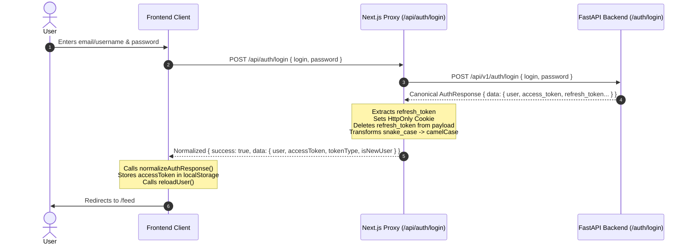
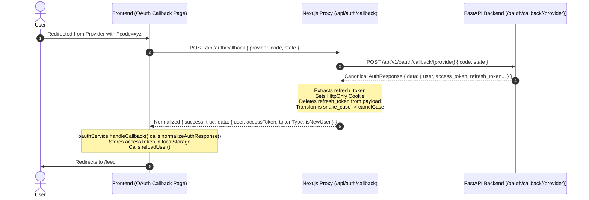

# Authentication System Specification v1.0

This document serves as the single source of truth for the Grateful authentication architecture. It establishes the strict boundaries, canonical data contracts, session management models, and error handling guarantees across the frontend, Next.js proxy layer, and FastAPI backend.

---

## 1. System Overview (Current State Only)

Grateful employs a decoupled, proxy-mediated authentication architecture designed for maximum security, clear separation of concerns, and strict schema contracts.

```
+-------------------------------------------------------------------------------+
|                                BROWSER / CLIENT                               |
|                                                                               |
|   +-----------------------+              +--------------------------------+   |
|   |   access_token        |              |  refresh_token                 |   |
|   |   (In-Memory /        |              |  (HttpOnly, Secure, SameSite)  |   |
|   |    localStorage)      |              |  Managed exclusively by Next   |   |
|   +-----------+-----------+              +---------------+----------------+   |
+---------------|------------------------------------------|--------------------+
                | Bearer Token                             | Automatic Cookie
                v                                          v Inclusion
+---------------|------------------------------------------|--------------------+
|               |              NEXT.JS PROXY LAYER         |                    |
|               |                                          |                    |
|   +-----------v-----------+              +---------------v----------------+   |
|   |  /api/* (Data Routes) |              | /api/auth/* (Auth Proxies)     |   |
|   |  Passes Bearer Token  |              | Intercepts & Sets Cookies      |   |
|   |  directly to backend  |              | Normalizes Auth Responses      |   |
|   +-----------+-----------+              +---------------+----------------+   |
+---------------|------------------------------------------|--------------------+
                | Authorization: Bearer <token>            | { refresh_token }
                v                                          v
+---------------|------------------------------------------|--------------------+
|               |             FASTAPI BACKEND (Auth Authority)                  |
|               |                                                               |
|   +-----------v-----------+              +---------------v----------------+   |
|   | Protected Endpoints   |              | /api/v1/auth/*                 |   |
|   | Validates JWT         |              | Issues canonical AuthResponse  |   |
|   +-----------------------+              +--------------------------------+   |
+-------------------------------------------------------------------------------+
```

### Core Responsibilities
- **Next.js acts as the authentication boundary layer**: All client authentication requests pass through Next.js API route proxies (`/api/auth/*`). Next.js intercepts tokens, manages secure HTTP-only cookies, strips sensitive refresh tokens before forwarding payloads to the client, and normalizes response casing.
- **FastAPI is the auth authority (token issuer)**: The backend operates entirely statelessly regarding session transport. It issues standard JWT access and refresh tokens, validates Bearer tokens, and returns canonical flat JSON structures. It has zero knowledge of cookies or browser storage mechanisms.
- **Browser State Separation**:
  - `access_token`: Ephemeral short-lived credential stored in client memory and `localStorage` for immediate API authorization.
  - `refresh_token`: Long-lived credential stored exclusively as an `HttpOnly`, `Secure`, `SameSite=Lax` cookie. It is never accessible to frontend JavaScript.

---

## 2. Canonical Authentication Flow

### Email Login Flow



1. **Client Initiation**: The user submits email (or username) and password credentials on `/auth/login`. The client posts JSON with a `login` field to `/api/auth/login`.
2. **Next.js Proxy Forwarding**: The proxy forwards the credentials to the FastAPI backend endpoint `/api/v1/auth/login`.
3. **Backend Response**: FastAPI validates credentials and issues a canonical `AuthResponse` containing a flat `data` object (`{ user, access_token, refresh_token, token_type, is_new_user }`).
4. **Proxy Interception & Cookie Management**:
   - Next.js extracts `refresh_token`.
   - Next.js sets the `refresh_token` cookie with `HttpOnly`, `Secure`, `SameSite=Lax`, and `maxAge=30 days`.
   - Next.js explicitly deletes `refresh_token` from the payload to prevent client-side exposure.
   - Next.js executes `transformApiResponse(data)` to convert all snake_case keys to camelCase.
5. **Client Session Hydration**:
   - The client invokes `normalizeAuthResponse(data)` to strictly extract `accessToken` and `user`.
   - `accessToken` is committed to `localStorage.setItem('access_token', token)`.
   - `reloadUser()` is awaited to hydrate the `UserContext` React state.
   - The user is redirected to `/feed`.

### OAuth Login Flow



1. **Provider Redirect**: The user completes authorization with Google/Facebook and is redirected to `/auth/callback?code=...`.
2. **Client Handling**: The callback page extracts URL search parameters and calls `oauthService.handleCallback(provider, code, state)`.
3. **Next.js Proxy Forwarding**: The service makes a `POST` request to `/api/auth/callback`, which forwards the authorization code to `/api/v1/oauth/callback/{provider}`.
4. **Backend Response**: The backend exchanges the code with the OAuth provider, creates or updates the user, and returns the exact same canonical `AuthResponse` as the email login flow.
5. **Proxy Interception & Normalization**:
   - Next.js extracts `refresh_token`, sets the `HttpOnly` cookie, deletes `refresh_token` from the payload, and applies camelCase transformation.
6. **Client Session Hydration**:
   - `oauthService.handleCallback` passes the payload through `normalizeAuthResponse(data)` and returns `NormalizedAuthData`.
   - The callback page calls `login(accessToken)`, awaits `reloadUser()`, and redirects to `/feed`.

---

## 3. Canonical Response Contract

To eliminate frontend defensive checks, schema branching, and parsing ambiguity, the backend authentication response is strictly locked to the following canonical contract.

### Backend Data Model (`AuthResponseData`)

```typescript
interface AuthResponseData {
  user: {
    id: string; // UUID string
    username: string;
    email: string;
    display_name?: string | null;
    profile_image_url?: string | null;
    is_active: boolean;
    is_superuser: boolean;
    created_at: string; // ISO 8601
  };
  access_token: string; // JWT
  refresh_token: string; // JWT
  token_type: "bearer"; // Always lowercase in backend
  is_new_user?: boolean; // True if account was created during this flow
}
```

### Full Backend Response Wrapper (`AuthResponse`)

```typescript
interface AuthResponse {
  success: boolean; // Always true for 200 OK
  data: AuthResponseData;
  timestamp: string; // ISO 8601
  request_id: string; // UUID
}
```

### Frontend Normalized Contract (`NormalizedAuthData`)

After passing through the Next.js proxy and the client-side `normalizeAuthResponse()` utility, the contract is strictly guaranteed as:

```typescript
interface NormalizedAuthData {
  user: {
    id: string;
    username: string;
    email: string;
    displayName?: string;
    profileImageUrl?: string;
    [key: string]: any;
  };
  accessToken: string;
  tokenType: string;
  isNewUser: boolean;
}
```

### Strict Architectural Rules
1. **NO nested `tokens` objects exist anywhere**: The legacy `{ tokens: { access_token, refresh_token } }` structure is permanently deprecated. Tokens are always top-level properties within the `data` object.
2. **NO alternate schemas exist anywhere**: Every authentication endpoint (`login`, `signup`, `refresh`, `oauth_callback`) must return the exact same flat structure using the backend `build_auth_response()` helper.
3. **NO mixed casing beyond proxy**: Casing transformation occurs exclusively at the Next.js proxy boundary. Frontend code must assume pure camelCase.

---

## 4. Session Model Specification

Grateful implements a dual-token session architecture separating short-lived transport credentials from long-lived persistent credentials.

```
+-----------------------------------------------------------------------+
|                             SESSION MODEL                             |
|                                                                       |
|   +--------------------------------+ +----------------------------+   |
|   |          ACCESS TOKEN          | |       REFRESH TOKEN        |   |
|   +--------------------------------+ +----------------------------+   |
|   | * JWT Bearer Token             | | * JWT Refresh Credential   |   |
|   | * 15 Minute Expiry             | | * 30 Day Expiry            |   |
|   | * Client Memory / localStorage | | * HttpOnly, Secure Cookie  |   |
|   | * Authorization Header         | | * Automatic Cookie Proxy   |   |
|   | * JS Accessible                | | * JS Inaccessible          |   |
|   +--------------------------------+ +----------------------------+   |
+-----------------------------------------------------------------------+
```

### Access Token Specification
- **Format**: JSON Web Token (JWT) signed with HS256.
- **Storage**: Stored in client memory and persisted in `window.localStorage.getItem('access_token')`.
- **Lifespan**: 15 minutes (`ACCESS_TOKEN_EXPIRE_MINUTES = 15`).
- **Transport**: Included in the `Authorization` HTTP header as `Bearer <token>` for all data API calls.
- **Security Profile**: Accessible to client JavaScript. Exposure risk is mitigated by its extremely short lifespan.

### Refresh Token Specification
- **Format**: JSON Web Token (JWT) signed with HS256.
- **Storage**: Stored exclusively as an HTTP cookie named `refresh_token`.
- **Lifespan**: 30 days (`REFRESH_TOKEN_EXPIRE_DAYS = 30`).
- **Cookie Flags**:
  - `HttpOnly: true` (Protects against XSS token theft).
  - `Secure: true` (Enforced on HTTPS and production environments; protects against MITM interception).
  - `SameSite: 'lax'` (Provides CSRF protection while permitting top-level navigation flows like OAuth).
  - `Path: '/'` (Available across all Next.js API proxy routes).
- **Transport**: Automatically included by the browser on requests to `/api/auth/refresh` and `/api/auth/logout`.
- **Rotation**: Rotated on every successful refresh call. The backend issues a new refresh token, and the Next.js proxy overwrites the existing cookie.

---

## 5. OAuth + Email Unification Rule

> **CRITICAL ARCHITECTURAL DIRECTIVE**: OAuth and Email authentication MUST behave identically after the Next.js proxy layer. Any divergence in data shape, token handling, or session hydration between them is considered an architectural regression and a bug.

### Unification Matrix

| Lifecycle Stage | Email Login Flow | OAuth Login Flow | Governing Layer |
| :--- | :--- | :--- | :--- |
| **Backend API Output** | `AuthResponse` (Flat) | `AuthResponse` (Flat) | FastAPI (`responses.py`) |
| **Cookie Management** | Intercepts & sets `refresh_token` | Intercepts & sets `refresh_token` | Next.js (`route.ts`) |
| **Payload Scrubbing** | Deletes `refresh_token` | Deletes `refresh_token` | Next.js (`route.ts`) |
| **Casing Conversion** | snake_case → camelCase | snake_case → camelCase | Next.js (`caseTransform.ts`) |
| **Client Normalization**| `normalizeAuthResponse(data)` | `normalizeAuthResponse(data)` | Client (`authNormalization`)|
| **Client Persistence** | `localStorage.setItem` | `localStorage.setItem` | Client (`auth.ts`) |
| **State Hydration** | `await reloadUser()` | `await reloadUser()` | Client (`UserContext.tsx`) |

---

## 6. System Boundaries

To maintain long-term stability and prevent defensive code proliferation, system boundaries are strictly enforced.

```
+-----------------------------------------------------------------------+
|                           SYSTEM BOUNDARIES                           |
|                                                                       |
|   +---------------------------------------------------------------+   |
|   |                        FASTAPI BACKEND                        |   |
|   |   * Issues canonical AuthResponse                             |   |
|   |   * Stateless JWT validation                                  |   |
|   |   * ZERO cookie knowledge                                     |   |
|   +-------------------------------+-------------------------------+   |
|                                   |                                   |
|                                   v AuthResponse                      |
|   +---------------------------------------------------------------+   |
|   |                      NEXT.JS PROXY LAYER                      |   |
|   |   * Intercepts refresh_token & sets HttpOnly cookie           |   |
|   |   * Deletes refresh_token from client payload                 |   |
|   |   * Transforms snake_case -> camelCase                        |   |
|   +-------------------------------+-------------------------------+   |
|                                   |                                   |
|                                   v Clean camelCase Payload           |
|   +---------------------------------------------------------------+   |
|   |                        FRONTEND CLIENT                        |   |
|   |   * Validates via normalizeAuthResponse()                     |   |
|   |   * Manages localStorage access_token                         |   |
|   |   * ZERO refresh_token access                                 |   |
|   +---------------------------------------------------------------+   |
+-----------------------------------------------------------------------+
```

### 1. FastAPI Backend Boundary
- **Allowed**: Issuing JWTs, validating Bearer tokens, returning canonical `AuthResponse` models.
- **Prohibited**: Setting `Set-Cookie` headers directly; reading cookies directly; formatting responses differently for social vs. email auth.

### 2. Next.js Proxy Boundary (`/api/auth/*`)
- **Allowed**: Intercepting backend responses; reading/setting `refresh_token` cookies; stripping sensitive fields; transforming casing.
- **Prohibited**: Bypassing casing transformations; forwarding `refresh_token` to the client; storing session state in Next.js server memory.

### 3. Frontend Client Boundary (`apps/web/src/*`)
- **Allowed**: Calling `normalizeAuthResponse()`; storing `access_token` in `localStorage`; attaching Bearer tokens to external requests; calling `/api/auth/refresh` on 401 errors.
- **Prohibited**: Implementing fallback guards (`result.tokens?.accessToken || result.accessToken`); accessing `refresh_token` directly; parsing raw snake_case backend payloads.

---

## 7. Session-Expiry & Redirect Pipeline

The frontend implements a centralized, event-driven pipeline for handling session expiry. This pipeline ensures that authentication failures (401/403) are handled uniformly regardless of which component initiated the request, eliminating ad-hoc redirect logic.

```
+-----------------------------------------------------------------------+
|                    SESSION-EXPIRY & REDIRECT PIPELINE                  |
|                                                                       |
|   Any API Request                                                     |
|       │                                                               |
|       v                                                               |
|   +---+-----------------------------------------------------------+   |
|   |                    apiClient.handleRequestError()              |   |
|   |                                                                |   |
|   |   1. Error message includes 'HTTP 401'?                        |   |
|   |      YES → attemptRefresh() → refresh succeeds?                |   |
|   |        YES → retry original request with new token              |   |
|   |        NO  → handleSessionExpired() (dispatch event)           |   |
|   |      NO  → generic retry logic (retries ?? 1)                  |   |
|   |      (403 is NOT treated as session-expiry globally)           |   |
|   +----------------------------+-----------------------------------+   |
|                                |                                       |
|                                v                                       |
|   +----------------------------+-----------------------------------+   |
|   |               handleSessionExpired() (authFailureHandler.ts)   |   |
|   |                                                                |   |
|   |   Dispatches CustomEvent 'auth:session-expired' on window     |   |
|   |   (Minimal event producer — no side effects in this function)  |   |
|   +----------------------------+-----------------------------------+   |
|                                |                                       |
|                                v                                       |
|   +----------------------------+-----------------------------------+   |
|   |           UserContext onSessionExpired callback                 |   |
|   |                                                                |   |
|   |   1. Sets isAuthTransitioning = true (spinner guard)           |   |
|   |   2. Stops notification polling                                |   |
|   |   3. auth.logout() → clears localStorage access_token          |   |
|   |   4. setCurrentUser(null) → clears React state                 |   |
|   |   5. Clears all caches (APICache, TaggedQueryCache)            |   |
|   |   6. Sets viewerScope to 'anon'                                |   |
|   |   7. window.location.replace(buildLoginRedirectUrl(...))       |   |
|   |      → hard browser navigation to login                       |   |
|   +----------------------------+-----------------------------------+   |
+-----------------------------------------------------------------------+
```

### 7.1 Auth Truth Hierarchy

Authentication state is determined by the following strict hierarchy. No component may independently determine authentication status:

1. **apiClient** — Makes the actual HTTP request. If the backend returns 401 (expired/invalid token), the client attempts a silent refresh. If the refresh fails, it calls `handleSessionExpired()`.
2. **UserContext** — React context that listens for `auth:session-expired` events, manages `currentUser` state, `isAuthTransitioning`, and orchestrates the redirect.
3. **UI rendering** — Components read `currentUser` and `isAuthTransitioning` from `useUser()`. They NEVER check `localStorage` directly or call `isAuthenticated()`.

**Critical rule**: UI must NEVER decide whether a session is valid. Only apiClient + UserContext may determine that. Components must always attempt API calls and let the error pipeline handle auth failures.

### 7.2 Render-Level Safeguards

| State | Type | Set By | Purpose |
|---|---|---|---|
| `isAuthTransitioning` | `UserContext` global | `handleSessionExpired` → UserContext listener | Prevents stale authenticated UI during session-expiry redirect |
| `isRedirectingToAuth` | Component-local state | Error effect in `[userId]/page.tsx` | Prevents fallback UI during SPA navigation redirect (no session to expire case) |
| `requireAuth()` | `useRequireAuth()` hook | Auth guard effect or explicit call | Calls `router.replace('/auth/login?redirect=...')` for soft redirect |

**`isAuthTransitioning`** is set only when the session-expired event fires (refresh cookie expired/revoked). It triggers a loading spinner and a hard `window.location.replace()` to login. This global guard prevents any component from rendering authenticated content during the redirect.

**`isRedirectingToAuth`** is local to the profile page. It handles the case where there was never a valid session (no token in localStorage) — the session-expired event doesn't fire because there was no session to expire. The profile page's error effect detects the 403 ("Not authenticated" from FastAPI's HTTPBearer), sets `isRedirectingToAuth = true`, and calls `requireAuth()`. The render tree checks this state before any fallback branch and shows a loading spinner instead.

Both guards are read at the top of the render tree, before any data-dependent branches:

```tsx
if (isAuthTransitioning || isRedirectingToAuth) {
  return <LoadingSpinner />
}
```

### 7.3 Profile Page Redirect Flow (SPA Navigation)

The profile page (`[userId]/page.tsx`) has the most complex auth lifecycle because it fires queries immediately when `authResolved = true`. During SPA navigation, the user's auth state is already known (unlike page refresh where SSR bootstraps first), creating a race between query execution and redirect.

```
SPA Navigation (feed → /profile/[userId]) with no session:

  1. Profile page mounts
     └─ currentUser = null, userLoading = false
     └─ canQueryProfile = true → queries enabled immediately

  2. Auth guard effect fires
     └─ requireAuth() → router.replace() scheduled

  3. useTaggedQuery fetchers fire (in parallel)
     └─ apiClient.getUserProfile() with NO auth header
     └─ apiClient.getUserPosts() with NO auth header

  4. Backend returns HTTP 403 (FastAPI HTTPBearer rejection)

  5. Error effect fires (403 detected + no session)
     └─ setIsRedirectingToAuth(true)
     └─ requireAuth()  ← collocated redirect trigger
     └─ return early   ← NO further state mutations

  6. React commits render
     └─ isRedirectingToAuth = true
     └─ Render guard: <LoadingSpinner />
     └─ navigation completes → /auth/login
```

**Key design decisions**:
- `retries: 0` on both profile and posts fetchers to prevent the two independent retry layers (deduplicator default `maxRetries=1`, apiClient default `retries=1`) from issuing 3× repeated 403 requests that keep the component alive.
- The redirect trigger is collocated with the error detection point (error effect), NOT in a separate effect that may not fire reliably during SPA navigation.
- After `setIsRedirectingToAuth(true)` + `requireAuth()`, the effect returns immediately — no `setError()`, `setIsLoading()`, or any other state mutation that could populate fallback branches.
- The fallback render ("Profile not found") cannot execute because the `isRedirectingToAuth` guard is checked first in the render tree.

### 7.4 Context-Aware 403 Classification

The backend returns **403** for two distinct scenarios with different frontend handling:

| Scenario | HTTP Status | Backend Source | Frontend Handling |
|---|---|---|---|
| No `Authorization` header | 403 `{"detail": "Not authenticated"}` | FastAPI `HTTPBearer` auto-reject | `currentUser` null → `requireAuth()` redirect |
| Expired/invalid JWT | 401 `{"error": {...}}` | `dependencies.py` → `AuthenticationError` | apiClient refresh pipeline → `handleSessionExpired()` |
| Authenticated, profile not found | 404 | Repository `NotFoundError` | Display "User not found" |

**Important**: There is NO private-profile feature. Profile access is always public when authenticated. Any 403 at the profile endpoint is an authentication failure, not a permission denial.

The classification is context-aware — it checks `currentUser` from UserContext rather than relying on HTTP status alone:

```typescript
// Auth-invalid 403: short-circuit all state mutations
if (
  profileQueryError &&
  !currentUser &&
  !userLoading &&
  errorMsg.includes('HTTP 403')
) {
  setIsRedirectingToAuth(true)
  requireAuth()
  return  // NO setError / setIsLoading
}
```

### 7.5 Query Retry Policy for Auth-Sensitive Fetches

Profile page fetchers use `retries: 0` to prevent retry loops from fighting the redirect:

```typescript
async () => apiClient.getUserProfile(userId, {
  skipCache: true,
  retries: 0,
})
```

Without this, two independent retry layers produce 3 total HTTP requests:
- **Deduplicator layer**: `requestDeduplicator.executeRequest()` — `maxRetries = 1` by default → 2 attempts
- **apiClient layer**: `handleRequestError()` — `(options.retries ?? 1) > 0` → 1 recursive retry

With `retries: 0`, both layers stop: deduplicator `maxRetries = 0` → 1 attempt; apiClient `0 > 0 = false` → no recursive retry.

### 7.6 Documented Remaining Edge Case

A transient render artifact may occur during SPA navigation (feed → profile) with expired session: the profile page briefly shows "Profile not found" before the redirect completes. This is a render-order race — React commits the fallback branch before `router.replace()` takes effect. It is cosmetic only:

- No security impact (redirect always completes)
- No data exposure (backend rejects unauthenticated requests)
- Does not occur on page refresh or direct navigation
- See `KNOWN_ISSUES.md` for details

---

## 8. Known Failure Modes (Postmortem Learnings)

Historical debugging of the Grateful authentication system revealed several critical failure patterns. These are documented below to prevent future regressions.

### 1. Missing Cookie = Proxy Parsing Bug (Not Browser Rejection)
- **Symptom**: `refresh_token` cookie is missing in the browser, causing silent authentication expiration after 15 minutes.
- **Root Cause**: If the backend alters its response structure (e.g. flattening `tokens: { refresh_token }` to top-level `refresh_token`), the Next.js proxy route will fail to extract `payload.tokens.refresh_token`. The proxy will silently skip `cookies.set()`.
- **Resolution**: Proxy routes must use strict top-level extraction (`payload.refresh_token`) aligned with `AuthResponse`.

### 2. OAuth Breakage = Response Shape Mismatch
- **Symptom**: OAuth callback page throws `undefined` token errors or triggers an infinite redirect loop (`/auth/callback` → `/feed` → `/login`).
- **Root Cause**: `oauthService.handleCallback` expecting legacy `result.tokens.accessToken` while the backend returns a flat structure. `result.tokens` evaluates to `undefined`, skipping `localStorage` persistence and `UserContext` hydration.
- **Resolution**: Enforce `normalizeAuthResponse()` at the service layer and access `result.accessToken` directly.

### 3. Redirect Loop = Missing `localStorage` Access Token
- **Symptom**: User successfully logs in or completes OAuth, lands on `/feed`, and is instantly bounced back to `/login`.
- **Root Cause**: `/feed` relies on `isAuthenticated()` which checks `!!localStorage.getItem('access_token')`. If the login/callback page fails to write the token before pushing `/feed`, the guard trips immediately.
- **Resolution**: Always call `login(accessToken)` and `await reloadUser()` synchronously before executing `router.push('/feed')`.

### 4. Silent Auth Failure = Inconsistent Normalization Layer
- **Symptom**: Some pages work perfectly while others fail to read user profile images or display names.
- **Root Cause**: Different pages performing ad-hoc extraction (`data.user.profile_image_url` vs `data.user.profileImageUrl`).
- **Resolution**: All auth flows must pass data through `normalizeAuthResponse()` to guarantee uniform `NormalizedAuthData` structures.

---

## 9. Welcome / Onboarding Flow

New users enter a guided onboarding flow immediately after account creation instead of being sent to the feed. This applies to all four account-creation paths: email signup, OAuth signup, password resurrection, and OAuth resurrection.

### Entry Points

| Entry | Backend route | `is_new_user` |
|-------|--------------|---------------|
| Email signup | `POST /api/v1/auth/signup` | `True` |
| OAuth signup | `POST /api/v1/oauth/callback/{provider}` | `True` |
| Password resurrection | `POST /api/v1/auth/signup` (same route) | `True` |
| OAuth resurrection (accept) | `POST /api/v1/auth/oauth/resurrect` | `True` |
| OAuth resurrection (decline) | `POST /api/v1/auth/oauth/resurrect` | `True` |

All five call `build_auth_response(is_new_user=True)` in `app/core/responses.py` — the sole gate for onboarding eligibility. Returning users (login, refresh, account linking) pass `is_new_user=False` and skip onboarding entirely.

### Full Onboarding Flow

```
Auth success (is_new_user=True)
    ↓
build_auth_response() generates signup_token JWT (15 min expiry)
    ↓
Next.js proxy setAuthCookies() stores signup_token as HttpOnly cookie
    ↓
Frontend redirects to /welcome
    ↓
WelcomePage route guard checks currentUser.signupEligible (from GET /me/profile)
    ↓
4-slide wizard: photo → profile info → account settings → confirmation
    ↓
Single POST /users/me/onboarding multipart/form-data
    ↓
On success: signup_token cookie cleared → redirect to /profile
```

**Key architectural rules:**
- **signup_token is a presentation gate only.** It is verified in `GET /me/profile` (to compute `signup_eligible`), not in the onboarding submission endpoint. `POST /users/me/onboarding` authenticates solely via the standard JWT Bearer token. An expired signup_token does not block a user mid-onboarding — they can finish and save data even if the gate expired.
- **Single submission.** All profile fields (text + photo) are collected in frontend `OnboardingData` state and sent together in one multipart POST. There is no partial-save or auto-save.

### Signup Token Specification

- **Format**: JWT signed with HS256 using the same `SECRET_KEY` as access tokens.
- **Claims**: `type: "signup"`, `purpose: "signup"`, `sub: user_id`, `exp`, `iat`, `nbf`, `jti`, `iss: "grateful-api"`, `aud: "grateful-client"`.
- **Expiry**: 15 minutes (`SIGNUP_TOKEN_EXPIRE_MINUTES` in `app/config/signup_token_config.py`).
- **Cookie**: `HttpOnly`, `Secure`, `SameSite=Lax`, `maxAge=15min`, `path=/`. Set by three proxy routes (`signup`, `callback`, `oauth-resurrect`) via the shared `setAuthCookies()` helper.
- **Validation**: `verify_signup_token()` decodes the JWT, verifies audience/issuer/claims, checks `type == "signup"` and `purpose == "signup"`. Returns payload or `None`.

### Welcome Page Route Guard

The welcome page (`(welcome)/welcome/page.tsx`) guards access via:

1. Authenticated user required (`currentUser` must exist).
2. `currentUser.signupEligible` must be `true`.
3. `signupEligible` is computed by `GET /users/me/profile` which reads the `signup_token` cookie, verifies the JWT, and checks that `sub` matches `current_user_id`.
4. If either check fails, the guard redirects to `/profile`.

### Onboarding Submission

The welcome page collects profile data (display name, bio, username, photo, etc.) in frontend `OnboardingData` state and submits a single `multipart/form-data` POST to `/users/me/onboarding`. This endpoint:

1. Authenticates via JWT (`get_current_user_id`).
2. Validates and saves all profile fields.
3. Does NOT require a signup token (the token only gates the `/welcome` page, not the submission API).
4. On success, the frontend proxy clears the `signup_token` cookie.

This ensures: user spends 30 minutes completing onboarding → token expires → Finish still works → data is saved → redirected to profile.

#### Photo handling contract (three explicit states)

Enforced by `if/elif` in the backend handler:

| Condition | Behavior | Backend path |
|-----------|----------|-------------|
| `file` provided | Replace existing photo | `ProfilePhotoService.upload_profile_photo()` |
| `remove_profile_image=true`, no `file` | Delete existing photo | `ProfilePhotoService.delete_profile_photo()` |
| Neither | No change | Field untouched |

Precedence: file upload > remove signal > no change. `remove_profile_image` is ignored when a file is also sent.

**Key rules:**
- `remove_profile_image` defaults to `False` (backward compatible).
- The welcome page never calls the standalone profile photo DELETE endpoint. All onboarding photo changes go through the single `/users/me/onboarding` POST.
- Frontend tracks `photoRemoved: boolean` in `OnboardingData` state, not in component-local state. This persists across slide navigation. The `buildFormData()` helper's `elif` guard ensures mutual exclusion: `remove_profile_image=true` is only appended when `photoRemoved` is true AND no new file is present.

#### Username Validation Flow

Username errors from the server are routed to the correct slide and field:

| Situation | Status | `error.code` | `error.message` |
|-----------|--------|-------------|-----------------|
| Invalid characters | 422 | `validation_error` | Username can only contain letters, numbers, and underscores |
| Username already exists | 409 | `already_exists` | Username already taken |

```
Submit → 409/422 { error: { code, message } }
    ↓
ERROR_FIELD_MAP
    ├── "already_exists"   → "username"
    └── "validation_error" → "username"
    ↓
FIELD_SLIDE_MAP ("username" → slide index 2)
    ↓
setFieldErrors({ username: message }) + setCurrentSlide(2)
    ↓
AccountSettingsForm receives usernameError prop → renders under field
    ↓
User edits field → setFieldErrors clears only username key
User presses Cancel → same clearing + username reset to original
Next submit → setFieldErrors({}) before attempt
```

`FIELD_SLIDE_MAP` also contains speculative entries for `display_name`, `bio`, `city`, `file` with corresponding slide indices — these are defensive (no backend error code currently populates them) and exist so that adding a new error code only requires a one-line map entry.

#### Validation Architecture — Usernames

| Layer | Location | Responsibility |
|-------|----------|----------------|
| Backend canonical | `app/core/validators.py:validate_username_format()` | Single source of truth: length 3–30, regex `^[a-z0-9_]+$`, lowercases |
| Backend DB | CHECK constraint in migration `7c99f5b56f04` | Last-line defense for DB-level consistency |
| Backend Pydantic | `UserCreate`, `UserProfileUpdate`, `OAuthResurrectionComplete` | Delegates to `validate_username_format()` |
| Frontend canonical | `src/utils/usernameValidation.ts` | Matches backend exactly: `normalizeUsername()`, `validateUsernameFormat()` |
| Profile page | inline `onChange` | Calls `normalizeUsername()` then `validateUsernameFormat()` — live feedback |
| Signup page | inline `onChange` + `handleSubmit` | Same pattern as Profile |
| Welcome page | inline `onChange` | Same pattern — server-driven on submit |
| Mention parsing | `mentionUtils.ts`, `idGuards.ts` | Intentionally broader charset (parsing/navigation, not registration) |

**Normalization responsibility:** `normalizeUsername()` is the canonical frontend lowercasing point. Both signup and profile call it in their onChange handlers for consistent UX. The backend also lowercases in `validate_username_format()` (defense-in-depth). No caller performs its own `.toLowerCase()`.

**Why backend validation is still required:** Frontend validation is an immediate UX improvement only. Backend validation at the Pydantic/service layer is the security boundary. A rogue request or compromised client bypasses frontend checks.

#### Password Validation Flow

Password validation follows the same layered architecture:

| Layer | Location | Responsibility |
|-------|----------|----------------|
| Backend canonical | `BaseService.validate_field_length(password, "password", 128, 8)` in `app/core/service_base.py` | Min 8, max 128 — called by `AuthService.signup()` and `UserService.update_password()` |
| Frontend canonical | `src/utils/passwordValidation.ts` | Mirrors backend: `validatePasswordFormat()`, `validatePasswordConfirmation()` |
| Signup | `handleSubmit` | Calls `validatePasswordConfirmation()` then `validatePasswordFormat()` |
| Profile change | `handleSaveAccount` | Same pattern — also checks `currentPassword` is present |
| Reset password | `handleSubmit` | Same pattern — previously had no client-side length check |

**Password policy:** Min 8, max 128. No character class requirements. Frontend mirrors this exactly; the backend `validate_field_length()` is the authoritative security boundary. The profile page previously used min 6 (a bug) — corrected during refactoring.

#### Live Password Validation — Evaluation

**Current behavior:**
- Signup: validates on submit only (no live feedback during typing)
- Profile: validates on submit only
- Reset: validates on submit only
- No page has live password validation

**Advantages of adding live validation:**
- Immediate feedback as user types (better UX)
- Reuses `validatePasswordFormat()` with almost no code — each onChange handler would call it, the same pattern as live username validation
- Consistent across all password-entry forms

**Disadvantages:**
- Live length validation on a password field is less useful than on a username — the user can't see what they're typing (masked input), so the feedback is less actionable
- Password fields often have show/hide toggle; even when visible, the UX gain is marginal compared to submitting and seeing the error
- Adds noise if user is actively typing and hasn't finished entering the password yet

**Recommendation:** Leave validation on submit only for all password flows. The submit-triggered validation already catches the same cases. Live validation on a masked field provides negligible UX improvement over submit-based validation. If a future UX audit identifies this as a friction point, the implementation path is trivial (add `validatePasswordFormat()` call in each `onChange` handler — same pattern as live username validation). The shared utility is already in place.

### OAuth Profile Import

OAuth data is persisted immediately at signup (not deferred to onboarding). `_create_oauth_user()` in `oauth_service.py` writes `profile_image_url` and `display_name` to the DB during account creation.

```
OAuth callback success (is_new_user=True)
    ↓
Auth response includes oauth_profile: {displayName, profileImageUrl}
    (display_name and profile_image_url written to DB at creation time)
    ↓
Callback page detects isNewUser + oauthProfile
    ↓
Shows import dialog
    ↓
Yes → sessionStorage.setItem('oauthImport', profile)
No  → skip
    ↓
Redirect to /welcome
    ↓
Welcome page pre-fills:
    • currentUser.displayName → form state (editable on slide 1)
    • currentUser.profileImageUrl → ProfilePhotoUpload (replaceable on slide 0)
    • currentUser.username → form state (editable on slide 2)
    ↓
User edits if desired, removes, or keeps the photo
    ↓
Onboarding POST persists final state:
    • file uploaded → replace
    • remove_profile_image=true → delete
    • neither       → keep existing
```

**"Only-fill-if-empty" on re-login/linking.** Three paths (`_update_oauth_user`, `apply_oauth_profile`, `_perform_oauth_linking`) only overwrite `display_name` and `profile_image_url` when the existing DB value is `NULL`. If the user customized these fields after onboarding, OAuth re-login does not revert them.

Key architectural decisions:
- **OAuth profile photo is persisted immediately** (not deferred to onboarding) — makes the photo available on the welcome page without an extra upload.
- **Onboarding supports explicit removal** via `remove_profile_image=true` form field — necessary because missing fields mean "no change."
- **Onboarding is the single write path** for text profile fields (display_name, bio, username, etc.).
- **Precedence rule:** If both `file` upload and `remove_profile_image=true` are sent, the file wins and `remove_profile_image` is ignored.

### External URL Architecture (OAuth Profile Images)

OAuth provider URLs (Google `lh3.googleusercontent.com`, Facebook `graph.facebook.com`) are stored **as-is** in `User.profile_image_url`, not downloaded or copied to local storage.

**Why external URLs are intentional:**

| Reason | Detail |
|--------|--------|
| No duplicate storage | Avoids storing the same image twice (S3/local + OAuth CDN) |
| No download pipeline | Eliminates upload latency, error handling, and resize processing for OAuth-originated images |
| Immediate availability | The URL works as soon as OAuth login completes, no processing delay |
| Fewer moving parts | No background sync, no migration on provider change, no cache invalidation |
| Works with existing serialization | `storage.get_url()` has an absolute-URL guard: URLs starting with `http://` or `https://` are returned unchanged |

**Risks:**

- Google avatar CDN paths can change (`lh3.googleusercontent.com` path structure is not documented as stable)
- Facebook `graph.facebook.com` URLs may require an `access_token` for some endpoints, causing 403s for unauthenticated viewers
- If a provider deprecates a URL format, old stored URLs 404
- No automatic refresh mechanism — stale URLs persist until the user uploads a new photo or the next OAuth login refreshes via the only-fills-if-empty policy

**Recommendation:** No mitigation implemented. The only-fills-if-empty policy ensures next OAuth login refreshes the URL. If stale URLs become a measurable problem, evaluate a photo proxy at that time.

### Cookie Management Centralization

All auth proxy routes (`signup`, `callback`, `oauth-resurrect`) use a shared helper `setAuthCookies()` in `auth-cookies.ts` instead of duplicating cookie-setting logic. This helper:

1. Extracts `refresh_token` and `signup_token` from the backend payload.
2. Deletes both from the response body (prevents JS access).
3. Sets `refresh_token` as HttpOnly cookie (30 day expiry).
4. Sets `signup_token` as HttpOnly cookie (15 min expiry) if present.

### Architectural Invariants

The onboarding system enforces the following invariants. Any deviation is a bug.

1. **Auth → onboarding is a single code path.** All new-user routes call `build_auth_response(is_new_user=True)`. No other mechanism produces a signup_token or sets onboarding eligibility.

2. **signup_token is presentation-only.** It gates the `/welcome` page via the route guard (`currentUser.signupEligible`). The onboarding submission endpoint authenticates via JWT only — an expired token mid-onboarding does not block saves.

3. **Onboarding is a single write path.** No auto-save, no partial save, no separate endpoint for individual fields during onboarding. All data arrives in one `POST /users/me/onboarding` call.

4. **Photo three-state contract is enforced server-side.** The backend `if/elif` ensures mutual exclusion. The frontend `buildFormData()` mirrors this with its own guard.

5. **Shared components are stateless with respect to onboarding.** `AccountSettingsForm` and `ProfileInformationForm` own only UI state (password visibility, pending list inputs). All onboarding data lives in the welcome page's `OnboardingData` state. No onboarding-specific logic has leaked into shared components.

6. **OAuth data is "import immediately, overwrite never."** Written to DB at account creation. On re-login, only fills empty fields. The welcome page pre-fills from the DB state but the user can edit or replace everything.

7. **Welcome page errors follow a consistent lifecycle.** Appear on failed submit → clear only the affected field on edit → clear on cancel (username only) → clear all before next submit. Only `username` can currently produce a field-level error; `display_name`, `bio`, `city`, and `file` have slide destinations mapped but no backend error code populates them.

---

## 10. Migration Summary

The Grateful authentication system evolved through three major architectural phases to reach its current mature state.

```
+-----------------------------------------------------------------------+
|                           MIGRATION HISTORY                           |
|                                                                       |
|   +---------------------------------------------------------------+   |
|   |                        LEGACY ARCHITECTURE                    |   |
|   |   * localStorage-only persistence (access + refresh tokens)   |   |
|   |   * Direct client-to-backend OAuth calls                      |   |
|   |   * Inconsistent, nested response schemas                     |   |
|   +-------------------------------+-------------------------------+   |
|                                   |                                   |
|                                   v Phase 1                           |
|   +---------------------------------------------------------------+   |
|   |                       INTERMEDIATE STATE                      |   |
|   |   * Next.js proxy introduced for HttpOnly cookies             |   |
|   |   * Dual-shape defensive guards in frontend                   |   |
|   |   * Fragile proxy parsing logic                               |   |
|   +-------------------------------+-------------------------------+   |
|                                   |                                   |
|                                   v Phase 2 (Current)                 |
|   +---------------------------------------------------------------+   |
|   |                       CURRENT SPEC v1.0                       |   |
|   |   * Canonical backend AuthResponse                            |   |
|   |   * Strict Next.js cookie & casing boundary                   |   |
|   |   * Centralized normalizeAuthResponse() client contract       |   |
|   +---------------------------------------------------------------+   |
+-----------------------------------------------------------------------+
```

### Legacy Architecture
- **Persistence**: Both `access_token` and `refresh_token` were stored in `localStorage`, exposing long-lived credentials to XSS vulnerabilities.
- **Routing**: Client code made direct calls to FastAPI OAuth endpoints, leading to CORS complexity and leaked provider secrets.
- **Schemas**: Endpoints returned arbitrary nested structures (`tokens` objects, mixed casing).

### Current Architecture (v1.0)
- **Persistence**: `refresh_token` is strictly isolated in an `HttpOnly` cookie. `localStorage` holds only the short-lived `access_token`.
- **Routing**: All auth traffic routes through Next.js `/api/auth/*` proxies.
- **Schemas**: Strict adherence to `AuthResponse` in the backend and `NormalizedAuthData` in the frontend.

---

## 11. Stability Guarantee Statement

> **AUTHORITATIVE GUARANTEE**: As of v1.0, authentication behavior is deterministic, secure, and fully unified across Email and OAuth flows. Any deviation between providers or login mechanisms is a bug in normalization or proxy handling, not expected behavior. The contracts defined in this specification are immutable for the v1.x lifecycle.

---
*End of Specification.*
