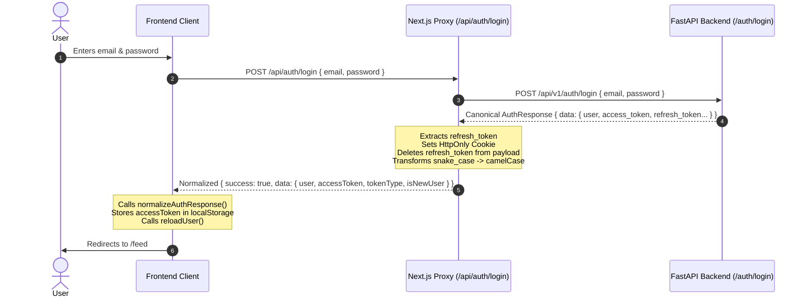
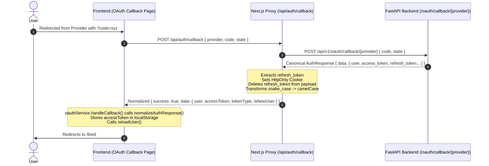

# Authentication System Specification v1.0

This document serves as the single source of truth for the Grateful authentication architecture. It establishes the strict boundaries, canonical data contracts, session management models, and error handling guarantees across the frontend, Next.js proxy layer, and FastAPI backend.

---

## 1. System Overview (Current State Only)

Grateful employs a decoupled, proxy-mediated authentication architecture designed for maximum security, clear separation of concerns, and strict schema contracts.

```
+-------------------------------------------------------------------------------+
|                                BROWSER / CLIENT                               |
|                                                                               |
|   +-----------------------+              +--------------------------------+   |
|   |   access_token        |              |  refresh_token                 |   |
|   |   (In-Memory /        |              |  (HttpOnly, Secure, SameSite)  |   |
|   |    localStorage)      |              |  Managed exclusively by Next   |   |
|   +-----------+-----------+              +---------------+----------------+   |
+---------------|------------------------------------------|--------------------+
                | Bearer Token                             | Automatic Cookie
                v                                          v Inclusion
+---------------|------------------------------------------|--------------------+
|               |              NEXT.JS PROXY LAYER         |                    |
|               |                                          |                    |
|   +-----------v-----------+              +---------------v----------------+   |
|   |  /api/* (Data Routes) |              | /api/auth/* (Auth Proxies)     |   |
|   |  Passes Bearer Token  |              | Intercepts & Sets Cookies      |   |
|   |  directly to backend  |              | Normalizes Auth Responses      |   |
|   +-----------+-----------+              +---------------+----------------+   |
+---------------|------------------------------------------|--------------------+
                | Authorization: Bearer <token>            | { refresh_token }
                v                                          v
+---------------|------------------------------------------|--------------------+
|               |             FASTAPI BACKEND (Auth Authority)                  |
|               |                                                               |
|   +-----------v-----------+              +---------------v----------------+   |
|   | Protected Endpoints   |              | /api/v1/auth/*                 |   |
|   | Validates JWT         |              | Issues canonical AuthResponse  |   |
|   +-----------------------+              +--------------------------------+   |
+-------------------------------------------------------------------------------+
```

### Core Responsibilities
- **Next.js acts as the authentication boundary layer**: All client authentication requests pass through Next.js API route proxies (`/api/auth/*`). Next.js intercepts tokens, manages secure HTTP-only cookies, strips sensitive refresh tokens before forwarding payloads to the client, and normalizes response casing.
- **FastAPI is the auth authority (token issuer)**: The backend operates entirely statelessly regarding session transport. It issues standard JWT access and refresh tokens, validates Bearer tokens, and returns canonical flat JSON structures. It has zero knowledge of cookies or browser storage mechanisms.
- **Browser State Separation**:
  - `access_token`: Ephemeral short-lived credential stored in client memory and `localStorage` for immediate API authorization.
  - `refresh_token`: Long-lived credential stored exclusively as an `HttpOnly`, `Secure`, `SameSite=Lax` cookie. It is never accessible to frontend JavaScript.

---

## 2. Canonical Authentication Flow

### Email Login Flow



1. **Client Initiation**: The user submits email and password credentials on `/auth/login`. The client posts JSON to `/api/auth/login`.
2. **Next.js Proxy Forwarding**: The proxy forwards the credentials to the FastAPI backend endpoint `/api/v1/auth/login`.
3. **Backend Response**: FastAPI validates credentials and issues a canonical `AuthResponse` containing a flat `data` object (`{ user, access_token, refresh_token, token_type, is_new_user }`).
4. **Proxy Interception & Cookie Management**:
   - Next.js extracts `refresh_token`.
   - Next.js sets the `refresh_token` cookie with `HttpOnly`, `Secure`, `SameSite=Lax`, and `maxAge=30 days`.
   - Next.js explicitly deletes `refresh_token` from the payload to prevent client-side exposure.
   - Next.js executes `transformApiResponse(data)` to convert all snake_case keys to camelCase.
5. **Client Session Hydration**:
   - The client invokes `normalizeAuthResponse(data)` to strictly extract `accessToken` and `user`.
   - `accessToken` is committed to `localStorage.setItem('access_token', token)`.
   - `reloadUser()` is awaited to hydrate the `UserContext` React state.
   - The user is redirected to `/feed`.

### OAuth Login Flow



1. **Provider Redirect**: The user completes authorization with Google/Facebook and is redirected to `/auth/callback?code=...`.
2. **Client Handling**: The callback page extracts URL search parameters and calls `oauthService.handleCallback(provider, code, state)`.
3. **Next.js Proxy Forwarding**: The service makes a `POST` request to `/api/auth/callback`, which forwards the authorization code to `/api/v1/oauth/callback/{provider}`.
4. **Backend Response**: The backend exchanges the code with the OAuth provider, creates or updates the user, and returns the exact same canonical `AuthResponse` as the email login flow.
5. **Proxy Interception & Normalization**:
   - Next.js extracts `refresh_token`, sets the `HttpOnly` cookie, deletes `refresh_token` from the payload, and applies camelCase transformation.
6. **Client Session Hydration**:
   - `oauthService.handleCallback` passes the payload through `normalizeAuthResponse(data)` and returns `NormalizedAuthData`.
   - The callback page calls `login(accessToken)`, awaits `reloadUser()`, and redirects to `/feed`.

---

## 3. Canonical Response Contract

To eliminate frontend defensive checks, schema branching, and parsing ambiguity, the backend authentication response is strictly locked to the following canonical contract.

### Backend Data Model (`AuthResponseData`)

```typescript
interface AuthResponseData {
  user: {
    id: string; // UUID string
    username: string;
    email: string;
    display_name?: string | null;
    profile_image_url?: string | null;
    is_active: boolean;
    is_superuser: boolean;
    created_at: string; // ISO 8601
  };
  access_token: string; // JWT
  refresh_token: string; // JWT
  token_type: "bearer"; // Always lowercase in backend
  is_new_user?: boolean; // True if account was created during this flow
}
```

### Full Backend Response Wrapper (`AuthResponse`)

```typescript
interface AuthResponse {
  success: boolean; // Always true for 200 OK
  data: AuthResponseData;
  timestamp: string; // ISO 8601
  request_id: string; // UUID
}
```

### Frontend Normalized Contract (`NormalizedAuthData`)

After passing through the Next.js proxy and the client-side `normalizeAuthResponse()` utility, the contract is strictly guaranteed as:

```typescript
interface NormalizedAuthData {
  user: {
    id: string;
    username: string;
    email: string;
    displayName?: string;
    profileImageUrl?: string;
    [key: string]: any;
  };
  accessToken: string;
  tokenType: string;
  isNewUser: boolean;
}
```

### Strict Architectural Rules
1. **NO nested `tokens` objects exist anywhere**: The legacy `{ tokens: { access_token, refresh_token } }` structure is permanently deprecated. Tokens are always top-level properties within the `data` object.
2. **NO alternate schemas exist anywhere**: Every authentication endpoint (`login`, `signup`, `refresh`, `oauth_callback`) must return the exact same flat structure using the backend `build_auth_response()` helper.
3. **NO mixed casing beyond proxy**: Casing transformation occurs exclusively at the Next.js proxy boundary. Frontend code must assume pure camelCase.

---

## 4. Session Model Specification

Grateful implements a dual-token session architecture separating short-lived transport credentials from long-lived persistent credentials.

```
+-----------------------------------------------------------------------+
|                             SESSION MODEL                             |
|                                                                       |
|   +--------------------------------+ +----------------------------+   |
|   |          ACCESS TOKEN          | |       REFRESH TOKEN        |   |
|   +--------------------------------+ +----------------------------+   |
|   | * JWT Bearer Token             | | * JWT Refresh Credential   |   |
|   | * 15 Minute Expiry             | | * 30 Day Expiry            |   |
|   | * Client Memory / localStorage | | * HttpOnly, Secure Cookie  |   |
|   | * Authorization Header         | | * Automatic Cookie Proxy   |   |
|   | * JS Accessible                | | * JS Inaccessible          |   |
|   +--------------------------------+ +----------------------------+   |
+-----------------------------------------------------------------------+
```

### Access Token Specification
- **Format**: JSON Web Token (JWT) signed with HS256.
- **Storage**: Stored in client memory and persisted in `window.localStorage.getItem('access_token')`.
- **Lifespan**: 15 minutes (`ACCESS_TOKEN_EXPIRE_MINUTES = 15`).
- **Transport**: Included in the `Authorization` HTTP header as `Bearer <token>` for all data API calls.
- **Security Profile**: Accessible to client JavaScript. Exposure risk is mitigated by its extremely short lifespan.

### Refresh Token Specification
- **Format**: JSON Web Token (JWT) signed with HS256.
- **Storage**: Stored exclusively as an HTTP cookie named `refresh_token`.
- **Lifespan**: 30 days (`REFRESH_TOKEN_EXPIRE_DAYS = 30`).
- **Cookie Flags**:
  - `HttpOnly: true` (Protects against XSS token theft).
  - `Secure: true` (Enforced on HTTPS and production environments; protects against MITM interception).
  - `SameSite: 'lax'` (Provides CSRF protection while permitting top-level navigation flows like OAuth).
  - `Path: '/'` (Available across all Next.js API proxy routes).
- **Transport**: Automatically included by the browser on requests to `/api/auth/refresh` and `/api/auth/logout`.
- **Rotation**: Rotated on every successful refresh call. The backend issues a new refresh token, and the Next.js proxy overwrites the existing cookie.

---

## 5. OAuth + Email Unification Rule

> **CRITICAL ARCHITECTURAL DIRECTIVE**: OAuth and Email authentication MUST behave identically after the Next.js proxy layer. Any divergence in data shape, token handling, or session hydration between them is considered an architectural regression and a bug.

### Unification Matrix

| Lifecycle Stage | Email Login Flow | OAuth Login Flow | Governing Layer |
| :--- | :--- | :--- | :--- |
| **Backend API Output** | `AuthResponse` (Flat) | `AuthResponse` (Flat) | FastAPI (`responses.py`) |
| **Cookie Management** | Intercepts & sets `refresh_token` | Intercepts & sets `refresh_token` | Next.js (`route.ts`) |
| **Payload Scrubbing** | Deletes `refresh_token` | Deletes `refresh_token` | Next.js (`route.ts`) |
| **Casing Conversion** | snake_case → camelCase | snake_case → camelCase | Next.js (`caseTransform.ts`) |
| **Client Normalization**| `normalizeAuthResponse(data)` | `normalizeAuthResponse(data)` | Client (`authNormalization`)|
| **Client Persistence** | `localStorage.setItem` | `localStorage.setItem` | Client (`auth.ts`) |
| **State Hydration** | `await reloadUser()` | `await reloadUser()` | Client (`UserContext.tsx`) |

---

## 6. System Boundaries

To maintain long-term stability and prevent defensive code proliferation, system boundaries are strictly enforced.

```
+-----------------------------------------------------------------------+
|                           SYSTEM BOUNDARIES                           |
|                                                                       |
|   +---------------------------------------------------------------+   |
|   |                        FASTAPI BACKEND                        |   |
|   |   * Issues canonical AuthResponse                             |   |
|   |   * Stateless JWT validation                                  |   |
|   |   * ZERO cookie knowledge                                     |   |
|   +-------------------------------+-------------------------------+   |
|                                   |                                   |
|                                   v AuthResponse                      |
|   +---------------------------------------------------------------+   |
|   |                      NEXT.JS PROXY LAYER                      |   |
|   |   * Intercepts refresh_token & sets HttpOnly cookie           |   |
|   |   * Deletes refresh_token from client payload                 |   |
|   |   * Transforms snake_case -> camelCase                        |   |
|   +-------------------------------+-------------------------------+   |
|                                   |                                   |
|                                   v Clean camelCase Payload           |
|   +---------------------------------------------------------------+   |
|   |                        FRONTEND CLIENT                        |   |
|   |   * Validates via normalizeAuthResponse()                     |   |
|   |   * Manages localStorage access_token                         |   |
|   |   * ZERO refresh_token access                                 |   |
|   +---------------------------------------------------------------+   |
+-----------------------------------------------------------------------+
```

### 1. FastAPI Backend Boundary
- **Allowed**: Issuing JWTs, validating Bearer tokens, returning canonical `AuthResponse` models.
- **Prohibited**: Setting `Set-Cookie` headers directly; reading cookies directly; formatting responses differently for social vs. email auth.

### 2. Next.js Proxy Boundary (`/api/auth/*`)
- **Allowed**: Intercepting backend responses; reading/setting `refresh_token` cookies; stripping sensitive fields; transforming casing.
- **Prohibited**: Bypassing casing transformations; forwarding `refresh_token` to the client; storing session state in Next.js server memory.

### 3. Frontend Client Boundary (`apps/web/src/*`)
- **Allowed**: Calling `normalizeAuthResponse()`; storing `access_token` in `localStorage`; attaching Bearer tokens to external requests; calling `/api/auth/refresh` on 401 errors.
- **Prohibited**: Implementing fallback guards (`result.tokens?.accessToken || result.accessToken`); accessing `refresh_token` directly; parsing raw snake_case backend payloads.

---

## 7. Known Failure Modes (Postmortem Learnings)

Historical debugging of the Grateful authentication system revealed several critical failure patterns. These are documented below to prevent future regressions.

### 1. Missing Cookie = Proxy Parsing Bug (Not Browser Rejection)
- **Symptom**: `refresh_token` cookie is missing in the browser, causing silent authentication expiration after 15 minutes.
- **Root Cause**: If the backend alters its response structure (e.g. flattening `tokens: { refresh_token }` to top-level `refresh_token`), the Next.js proxy route will fail to extract `payload.tokens.refresh_token`. The proxy will silently skip `cookies.set()`.
- **Resolution**: Proxy routes must use strict top-level extraction (`payload.refresh_token`) aligned with `AuthResponse`.

### 2. OAuth Breakage = Response Shape Mismatch
- **Symptom**: OAuth callback page throws `undefined` token errors or triggers an infinite redirect loop (`/auth/callback` → `/feed` → `/login`).
- **Root Cause**: `oauthService.handleCallback` expecting legacy `result.tokens.accessToken` while the backend returns a flat structure. `result.tokens` evaluates to `undefined`, skipping `localStorage` persistence and `UserContext` hydration.
- **Resolution**: Enforce `normalizeAuthResponse()` at the service layer and access `result.accessToken` directly.

### 3. Redirect Loop = Missing `localStorage` Access Token
- **Symptom**: User successfully logs in or completes OAuth, lands on `/feed`, and is instantly bounced back to `/login`.
- **Root Cause**: `/feed` relies on `isAuthenticated()` which checks `!!localStorage.getItem('access_token')`. If the login/callback page fails to write the token before pushing `/feed`, the guard trips immediately.
- **Resolution**: Always call `login(accessToken)` and `await reloadUser()` synchronously before executing `router.push('/feed')`.

### 4. Silent Auth Failure = Inconsistent Normalization Layer
- **Symptom**: Some pages work perfectly while others fail to read user profile images or display names.
- **Root Cause**: Different pages performing ad-hoc extraction (`data.user.profile_image_url` vs `data.user.profileImageUrl`).
- **Resolution**: All auth flows must pass data through `normalizeAuthResponse()` to guarantee uniform `NormalizedAuthData` structures.

---

## 8. Migration Summary

The Grateful authentication system evolved through three major architectural phases to reach its current mature state.

```
+-----------------------------------------------------------------------+
|                           MIGRATION HISTORY                           |
|                                                                       |
|   +---------------------------------------------------------------+   |
|   |                        LEGACY ARCHITECTURE                    |   |
|   |   * localStorage-only persistence (access + refresh tokens)   |   |
|   |   * Direct client-to-backend OAuth calls                      |   |
|   |   * Inconsistent, nested response schemas                     |   |
|   +-------------------------------+-------------------------------+   |
|                                   |                                   |
|                                   v Phase 1                           |
|   +---------------------------------------------------------------+   |
|   |                       INTERMEDIATE STATE                      |   |
|   |   * Next.js proxy introduced for HttpOnly cookies             |   |
|   |   * Dual-shape defensive guards in frontend                   |   |
|   |   * Fragile proxy parsing logic                               |   |
|   +-------------------------------+-------------------------------+   |
|                                   |                                   |
|                                   v Phase 2 (Current)                 |
|   +---------------------------------------------------------------+   |
|   |                       CURRENT SPEC v1.0                       |   |
|   |   * Canonical backend AuthResponse                            |   |
|   |   * Strict Next.js cookie & casing boundary                   |   |
|   |   * Centralized normalizeAuthResponse() client contract       |   |
|   +---------------------------------------------------------------+   |
+-----------------------------------------------------------------------+
```

### Legacy Architecture
- **Persistence**: Both `access_token` and `refresh_token` were stored in `localStorage`, exposing long-lived credentials to XSS vulnerabilities.
- **Routing**: Client code made direct calls to FastAPI OAuth endpoints, leading to CORS complexity and leaked provider secrets.
- **Schemas**: Endpoints returned arbitrary nested structures (`tokens` objects, mixed casing).

### Current Architecture (v1.0)
- **Persistence**: `refresh_token` is strictly isolated in an `HttpOnly` cookie. `localStorage` holds only the short-lived `access_token`.
- **Routing**: All auth traffic routes through Next.js `/api/auth/*` proxies.
- **Schemas**: Strict adherence to `AuthResponse` in the backend and `NormalizedAuthData` in the frontend.

---

## 9. Stability Guarantee Statement

> **AUTHORITATIVE GUARANTEE**: As of v1.0, authentication behavior is deterministic, secure, and fully unified across Email and OAuth flows. Any deviation between providers or login mechanisms is a bug in normalization or proxy handling, not expected behavior. The contracts defined in this specification are immutable for the v1.x lifecycle.

---
*End of Specification.*
